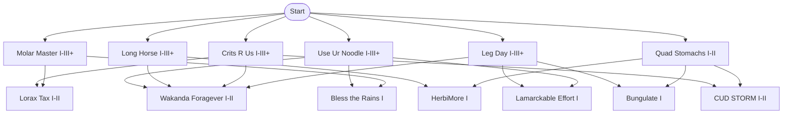

# Upgrade Tree Flowchart

## Unlock conditions (current)

- **Wakanda Foragever**: `Leg Day I` + `Crits R Us I` + `Long Horse I` + `Use Ur Noodle I`
- **Lorax Tax**: `Molar Master III` + `Crits R Us III`
- **CUD STORM**: `Quad Stomachs II` + `Crits R Us III`
- **Bless the Rains**: `Molar Master III` + `Use Ur Noodle III`
- **Bungulate**: `Quad Stomachs II` + `Leg Day III`
- **Lamarckable Effort**: `Use Ur Noodle III` + `Leg Day III`
- **HerbiMore**: `Quad Stomachs II` + `Long Horse III`
